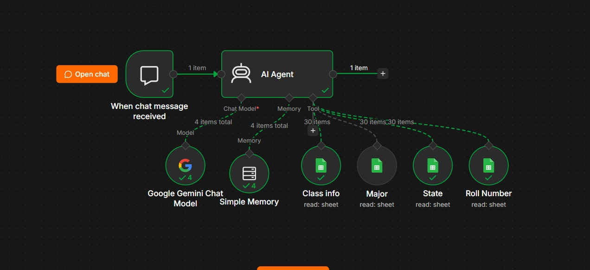
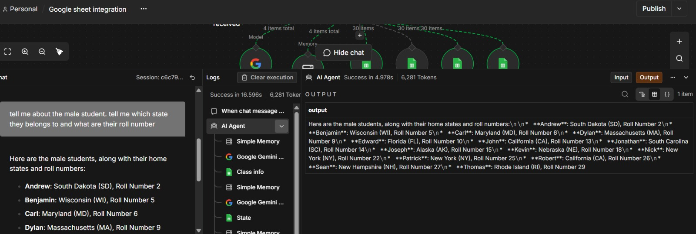

# 🤖 AI-Powered Google Sheets Data Automation Using n8n

## 📌 Overview

This project uses **n8n, an AI Agent, OpenAI API, and Google Sheets** to automate data retrieval and answer user questions in natural language.

## 🎯 Problem Statement

Searching spreadsheets manually for customer or order information can be repetitive and time-consuming. This project simplifies the process by allowing users to ask questions and receive relevant information automatically.

## 🛠️ Technologies Used

* ⚙️ **n8n** — Workflow automation
* 🧠 **OpenAI API** — AI-powered responses
* 📊 **Google Sheets** — Data storage and retrieval
* 🤖 **AI Agent** — Processes questions and uses connected tools

## 🔄 Workflow

1. 💬 The user asks a question through the chat interface.
2. 🧠 The AI Agent understands the request.
3. 📊 Google Sheets is queried for relevant information.
4. ⚙️ n8n processes the workflow.
5. ✅ The AI Agent returns a response based on the available data.

## 📸 Project Screenshots

### 1. ⚙️ n8n Workflow

### 2. ✅ Working Result

## ✨ Key Features

* Natural-language questions about spreadsheet data
* Automated data retrieval
* AI-generated responses based on available records
* No-code/low-code workflow integration

## 📚 What I Learned

* Building AI-powered workflows using n8n
* Integrating AI models with Google Sheets
* Configuring AI Agents and connected tools
* Testing workflow execution and handling missing records

## 🚀 Future Improvements

* Add email and WhatsApp notifications
* Improve error handling and data validation
* Integrate additional business tools
* Add reporting and analytics features

## 🔐 Security

API keys and credentials are managed through n8n credentials. Sensitive information should never be uploaded to GitHub.

---

⭐ *Built as a hands-on project to explore AI automation and workflow integration.*
